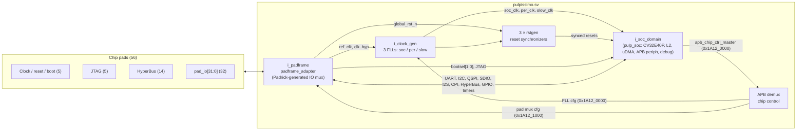

# Lab 1 – Step 4: `pulpissimo.sv` top level and pad diagram

Sources read:

- [`hw/pulpissimo.sv`](../../../hw/pulpissimo.sv): top level (ASIC and RTL simulation)
- [`hw/padframe/padframe_adapter.sv`](../../../hw/padframe/padframe_adapter.sv): wraps the generated padframe
- [`hw/padframe/rtl_sim_padframe_config_top.yml`](../../../hw/padframe/rtl_sim_padframe_config_top.yml),
  [`rtl_sim_config/rtl_sim_pads.yml`](../../../hw/padframe/rtl_sim_config/rtl_sim_pads.yml),
  [`common_peripherals.yml`](../../../hw/padframe/common_peripherals.yml),
  [`gpio_count.txt`](../../../hw/padframe/gpio_count.txt): Padrick configuration from which the padframe RTL is generated

## 1. What the top level contains

`pulpissimo.sv` is thin. It only has four blocks, and all SoC logic is inside
`soc_domain` (which wraps `pulp_soc` from a separate repository):



| Instance | Module | Role |
|---|---|---|
| `i_clock_gen` | `clock_gen` | Generates `soc_clk`, `per_clk` and `slow_clk` from the 32 kHz `ref_clk` with FLLs. Bypass: `pad_clk_byp_en` pin or the legacy JTAG TAP. Configured over APB. Removed when `EXTERNAL_CLOCK` is defined (Verilator). |
| `i_rstgen_{slow,soc,per}_clk` | `rstgen` | One synchronized reset per clock domain, all from the same `pad_reset_n`. |
| `i_apb_demux_addr_decode`, `i_demux`, `i_err_slv` | `addr_decode`, `apb_demux_intf`, `apb_err_slv_intf` | Splits the chip-control APB port of the SoC into FLL config and pad config. Other addresses go to an error slave. |
| `i_padframe` | `padframe_adapter` | Pads and the full IO multiplexer, generated by Padrick. |
| `i_soc_domain` | `soc_domain` | The whole SoC. |

Parameters of the top level: `CORE_TYPE` (0 = CV32E40P, 1 = Ibex RV32IMC,
2 = Ibex RV32EC), `USE_XPULP`, `USE_FPU`, `USE_ZFINX`, `USE_HWPE`,
`SIM_STDOUT` (virtual stdout, simulation only) and
`IO_PAD_COUNT = gpio_reg_pkg::GPIOCount` (32).

## 2. Pad groups

There are **56 pads**. 24 are *static*: each has one fixed function. 32 are
*muxed*: `pad_io[31:0]` can carry any peripheral signal. All pads use the
generic `pull_up_pad` type in RTL simulation.

```
                               PULPissimo padframe (RTL sim config)
  ┌───────────────────────────────────────────────────────────────────────────────┐
  │  CLOCK / RESET / BOOT (static, in)      JTAG (static)                         │
  │   pad_ref_clk      32 kHz ref clock      pad_jtag_tck    in   clock           │
  │   pad_clk_byp_en   FLL bypass (act-hi)   pad_jtag_tms    in   mode select     │
  │   pad_reset_n      async reset (act-lo)  pad_jtag_tdi    in   data in         │
  │   pad_bootsel0/1   boot mode             pad_jtag_trstn  in   reset (act-lo)  │
  │                    00 SPI flash          pad_jtag_tdo    out  data out        │
  │                    01 JTAG                                                    │
  │                    10 HyperFlash                                              │
  │                                                                               │
  │  HYPERBUS (static, dedicated to udma_hyper)                                   │
  │   pad_hyper_csn[1:0]  out  chip selects (act-lo)                              │
  │   pad_hyper_reset_n   out  device reset                                       │
  │   pad_hyper_ck/ckn    out  differential clock                                 │
  │   pad_hyper_dq[7:0]   bidir data (dir = hyper_dq_oe)                          │
  │   pad_hyper_rwds      bidir read/write data strobe                            │
  │                                                                               │
  │  GENERAL PURPOSE (muxed, any-to-any)                                          │
  │   pad_io[31:0]  default after reset: pad_io[i] = GPIO i                       │
  │                 can be reassigned by software to any signal of:               │
  │                 UART0, I2C0, QSPIM0, SDIO0, I2S0, CPI0, TIMER0..3, GPIO       │
  └───────────────────────────────────────────────────────────────────────────────┘
```

### 2.1 Static pads (24)

| Group | Pads | # | Dir | Function |
|---|---|---|---|---|
| Clock | `pad_ref_clk` | 1 | in | 32 kHz reference for the FLLs |
| Clock | `pad_clk_byp_en` | 1 | in | Active-high. Bypasses the FLLs so the SoC runs directly on `ref_clk` |
| Reset | `pad_reset_n` | 1 | in | Active-low asynchronous reset, synchronized inside |
| Boot | `pad_bootsel0`, `pad_bootsel1` | 2 | in | Boot mode: `00` SPI flash, `01` JTAG, `10` HyperFlash |
| JTAG | `pad_jtag_tck`, `_tms`, `_tdi`, `_trstn` | 4 | in | Debug and preload. Used by the testbench to load the hello program |
| JTAG | `pad_jtag_tdo` | 1 | out | JTAG data out |
| HyperBus | `pad_hyper_csn[1:0]` | 2 | out | Chip selects (HyperFlash / HyperRAM) |
| HyperBus | `pad_hyper_reset_n` | 1 | out | External memory reset |
| HyperBus | `pad_hyper_ck`, `pad_hyper_ckn` | 2 | out | Differential clock |
| HyperBus | `pad_hyper_dq[7:0]` | 8 | bidir | Data. Direction from `hyper_dq_oe` |
| HyperBus | `pad_hyper_rwds` | 1 | bidir | Read/write data strobe |

### 2.2 Muxed pads (32) and the signals they can carry

Each `pad_io[i]` has a mux. The select register is in the pad-config APB
region (`0x1A12_1000`). Every peripheral below belongs to mux group
`all_muxed_ios`, so each of its signals can be routed to **any** of the 32
pads. GPIO `i` belongs only to group `pad_io{i}`, so GPIO *i* can only appear
on `pad_io[i]`. This is the default connection after reset.

| Peripheral (uDMA / APB) | Instances | Signals that can be muxed | # signals |
|---|---|---|---|
| GPIO | 32 bits | `gpio[i]` on `pad_io[i]` only, bidirectional | 32 |
| UART | 1 | `rx` (in), `tx` (out) | 2 |
| I2C | 1 | `sda`, `scl` (bidir, open-drain via `oe`) | 2 |
| QSPI master | 1 | `sdio[3:0]` (bidir), `sck` (out), `csn[3:0]` (out) | 9 |
| SDIO (SD card) | 1 | `sdclk` (out), `sdcmd` (bidir), `sddata[3:0]` (bidir) | 6 |
| I2S | 1 | master: `sck`, `ws`, `sd[1:0]`; slave: `sck`, `ws`, `sd[1:0]` | 8 |
| CPI (camera) | 1 | `pclk`, `hsync`, `vsync`, `data[9:0]` (all in) | 13 |
| Advanced timer | 4 | `timer[k].out[3:0]` (PWM out) | 16 |

The peripherals offer 56 signals in total (plus 32 GPIO), but there are only
32 pads. The software must pick which interfaces get a pin, for example UART
+ QSPI + I2C = 13 pads, and the remaining 19 stay GPIO.

### 2.3 Differences in the FPGA configuration

`fpga_padframe_config_top.yml` uses the same `common_peripherals.yml` with
FPGA pad types (`hw/padframe/fpga_config/`). Each board has its own top level
(for example `target/fpga/pulpissimo-genesys2/rtl/xilinx_pulpissimo.v`) that
exposes only the pins available on that board. On FPGA, `hw/clock_gen_fpga.sv`
replaces the FLLs with Xilinx clock-wizard IPs (`xilinx_clk_mngr`,
`xilinx_slow_clk_mngr`).

## 3. Observations

1. The top level is only glue logic. Moving to another board or technology
   means changing the padframe YAML and `clock_gen`, not `pulp_soc`.
2. PULPissimo v8 dropped the fixed pin-to-function table. The IO mux is
   described in YAML and generated by Padrick, which makes it easy to change
   the number of GPIOs (`make gpio-reconfigure GPIO=<n>`) or add a new
   peripheral port group.
3. HyperBus and JTAG are not muxed, because they are needed for boot
   (`bootsel = 01/10`). SPI-flash boot (`00`) needs the QSPI signals, which
   are muxed, so the boot code must set the pad mux first.
4. **Possible bug in the I2C `scl` pad (not verified in simulation):**
   `common_peripherals.yml` connects `sda` as `tx_en: sda_oe` but `scl` as
   `rx_en: scl_oe, tx_en: ~scl_oe`. In `udma_i2c_control.sv` both signals
   use the same active-high polarity (`scl_oe = ~s_scl_oen`,
   `sda_oe = ~s_sda_oen`). If so, the pad drives SCL exactly when the I2C
   controller wants to release it.
